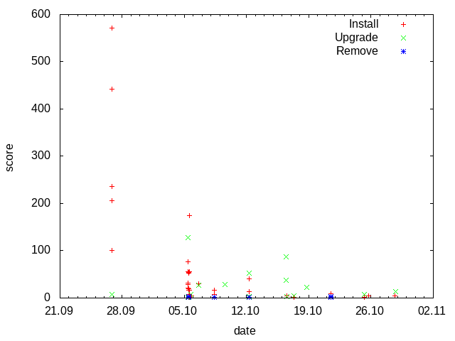

Examples
========

Create frequency graph from a log
---------------------------------

**Task:** Read /var/log/dpkg.log and create a graph to visualize how often packages are installed, upgraded and removed.

**Solution:** The loop (94) calls function *read_log* which reads the log line by line (27) and splits the fields date and time in minutes (29.33) and status (34,36). Third field of the log *status* is status of the dpkg operation(install, upgrade, remove ...). Method *zincrby* (37) increments by 1 the score of *date* in the key *status*. As a result the database contains keys(install, upgrade, remove ...) and associated lists of *dates* sorted by score. Next loop (101) calls the function *write_csv* with all keys.  As a result *status.csv* files are created in the current directory with the *(date;score)* pairs.

`[create-graph-01.c] <https://github.com/vbotka/redis-c-examples/blob/master/docs/source/code/create-graph-01.c>`_

.. highlight:: c
    :linenothreshold: 5

.. literalinclude:: code/create-graph-01.c
    :language: c
    :emphasize-lines: 43, 59, 78, 89, 90, 97, 106
    :linenos:

**Result:** The *status.csv* files can be used to create a graph with *gnuplot*.

`[create-graph-01.gnuplot] <https://github.com/vbotka/redis-c-examples/blob/master/docs/source/code/create-graph-01.gnuplot>`_

List 10 most used words in a text
---------------------------------

**Task:** Read text from a file and list 10 most frequently used words in it.

**Solution:** Let's use article about Redis at wikipedia.org as a text.

`[create-topchart-text.bash] <https://github.com/vbotka/redis-c-examples/blob/master/docs/source/code/create-topchart-text.bash>`_

.. literalinclude:: code/create-topchart-text.bash

*zincrby* (49) increments by 1 the score of *word* in the key *topchart* and *zrange* (58) returns top 10 words with scores.

`[create-topchart.c] <https://github.com/vbotka/redis-c-examples/blob/master/docs/source/code/create-topchart.c>`_

.. literalinclude:: code/create-topchart.c
    :language: c
    :emphasize-lines: 31, 42, 43, 50, 57, 65
    :linenos:

**Result:**

.. code-block:: bash

  > ./create-topchart
  10 "Retrieved"
  10 "by"
  10 "database"
  19 "in"
  21 "is"
  24 "and"
  30 "of"
  30 "to"
  33 "the"
  57 "Redis"
